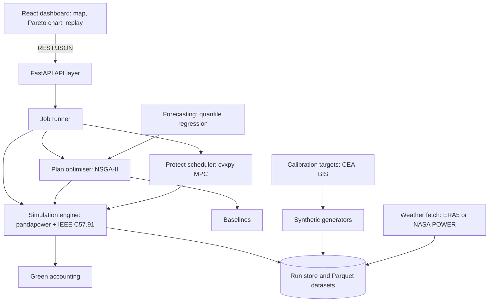

# GreenTrafo TDD: Technical Design Document

> This is the production design. For what the prototype in this repo actually implements,
> see [`../STATUS.md`](../STATUS.md). Rendered version with diagrams:
> https://claude.ai/code/artifact/5f9323da-8d8c-4842-9b4a-f84c6313bd18

## 1. Product overview

**Product name:** GreenTrafo

**One-line description:** a software-only, green grid-reliability tool that treats each
distribution transformer's thermal life as a budget, and optimises how a DISCOM spends it
before summer (Plan) and protects it during peak evenings (Protect).

**Problem being solved:** overloaded distribution transformers cause most summer load
shedding, and planners and operators cannot see or spend their remaining thermal life.

**Target users:** DISCOM planning engineers and control-room operators (primary);
sustainability leads and EV owners (secondary).

**Primary use case:** rank and choose capex actions (upgrade, rebalance, mobile unit) for a
suburb of about 40 transformers under a fixed budget.

**Secondary use cases:** shift flexible EV and AC load during a heatwave evening to keep
hot-spot temperature within limits; report green outcomes (avoided replacements, avoided
diesel hours, peak energy shifted).

## 2. Problem definition

A 2026 CEA advisory says summer outages come mainly from overloaded distribution
transformers and feeders, voltage drop and ageing equipment, and that most load shedding is
avoidable if vulnerable assets are found at least six months ahead. Load that exceeds
sanctioned limits is invisible to planners.

**Current workflow.** DISCOMs flag assets above 80% loading, upgrade those above 90%, and
react to failures with mobile transformers. Evening EV and AC load is unmanaged.

**Pain points**
- A single threshold ignores load shape, ambient temperature and unsanctioned growth.
- The upgrade budget rarely covers every flagged asset, and no tool shows the trade-off.
- Hot-spot temperature and loss-of-life are not observed, so damage accumulates unseen.
- Evening AC peaks coincide with falling solar output and growing EV charging.

**Why existing solutions are insufficient.** Schneider's ADMS and One Digital Grid Platform
work on digitised networks; its EV software prioritises building load to prevent trips. We
found no public evidence of a tool that treats a neighbourhood transformer's thermal life
as a shared budget across planning and operations.

**Environmental impact (green).** Fewer premature failures mean fewer replacement units to
manufacture, fewer outage hours covered by diesel, more headroom for rooftop solar and EV
charging, and less evening-peak energy drawn from the least green part of the grid.

## 3. Goals

**Functional:** generate a reproducible synthetic suburb (~40 transformers, 90-day summer,
EV sessions); compute loading, hot-spot temperature, ageing factor and loss-of-life; produce
a Pareto set of capex plans vs the 80/90 baseline at equal budget; produce an EV+AC schedule
that respects departure times within the thermal limit.

**Green:** report avoided replacements, avoided diesel hours and evening-peak kWh shifted,
with formulas visible; keep the tool itself low-carbon (CPU-only).

**Technical:** deterministic per seed; Plan under 10s, warm-start under 5s; thermal model
unit-tested against the textbook IEEE C57.91 example; clean module boundaries.

## 4. Non-goals

- No custom hardware, sensors or smart meters, and no real DISCOM integration (SCADA, ADMS, billing).
- No real-time charger control; Protect outputs proposed schedules in simulation.
- No outage restoration, FLISR or crew dispatch (Schneider's ADMS covers these).
- No LT topology inference, tariff design, cold-chain or irrigation features.
- No claim of validated performance on real Indian networks.
- No quantum or causal-ML components; the optimiser is a classical multi-objective EA.

## 5. Users and actors

| Actor | Type | Role |
| --- | --- | --- |
| Planning engineer | Human, primary | Sets budget and scenario, runs Plan, selects a plan |
| Control-room operator | Human, primary | Watches the heatwave replay, reviews Protect schedules |
| Sustainability lead | Human, secondary | Reads green outcomes and assumptions |
| EV owner | Simulated | Declares departure time and energy need |
| Simulation engine | System | Produces loading, temperature and loss-of-life |
| Optimiser services | System | Plan (evolutionary) and Protect (convex) |
| External data sources | System | Weather reanalysis and published statistics, offline |

## 6. User journey

**Plan:** input (budget, scenario, seed) → engine simulates sampled summer days → quantile
load-growth forecast + evolutionary optimiser search → planner picks a profile → per-
transformer action list with reasons → overload hours, loss-of-life, capex vs baseline →
budget change triggers warm-start re-plan.

**Protect:** input (chosen plan, heatwave evening, EV sessions) → engine predicts hot-spot
per transformer → at-risk transformers flagged → scheduler shifts flexible load within hard
constraints → schedule + trade-off (kWh shifted, on-time sessions) → loss-of-life saved and
green outcomes vs unmanaged and time-of-use → realised temperatures feed the next day.

## 7. System architecture

A single FastAPI service runs simulation, Plan and Protect jobs on demand, backed by seeded
datasets and a small run store, with a React dashboard on top.

**Component communication:** Dashboard → API (REST/JSON); API → Job runner (background
task); Job runner / Plan / Protect → Simulation engine (Python calls); Forecasting → Plan;
Engine & optimisers → Run store (SQLite + Parquet); Ingestion jobs → Datasets (offline).

**Cross-cutting:** no auth in the demo (dependency hook for tokens later); structured logs
with run id and seed; SQLite or in-memory run store + Parquet + one YAML config; Docker
Compose locally; ERA5/NASA POWER fetched once and cached.

## 8. Data model

Entities: Config (versioned YAML), Transformer (rating, age class, thermal constants,
upgrade cost), Customer group (sanctioned kW, unsanctioned growth, AC share, EV count),
Load profile (15-min base/AC/solar kW), EV session (arrival, departure, energy, max kW),
Scenario (ambient series, AC/EV growth), Plan (actions + metrics), Run (seed, config
version, status). Result tables: Thermal series, Pareto solution, Schedule, Green outcome.
Time series live in Parquet keyed by seed and config version; metadata in SQLite.

## 9. Simulation engine design

A pure Python library; Plan, Protect and the API all call `simulate(network, loads,
ambient, config)`. Pipeline: build radial 11 kV feeder (pandapower) → build 15-min loads
→ time-series power flow → discrete IEEE C57.91 thermal step → ageing/loss-of-life → event
flags. Power flow runs once per step for all transformers (vectorised); OpenDSS optional for
LV unbalance validation; results cached by (seed, config version, scenario). Deterministic
from a seeded NumPy generator.

## 10. Plan module design

Decision vector: one action per transformer from {none, upgrade, rebalance, mobile_unit}.
Objectives (minimise): capex, expected overload hours, expected loss-of-life. Constraints:
budget and mobile-unit count. Algorithm: NSGA-II (constrained non-dominated sort + crowding
distance), tournament selection, uniform crossover, per-gene mutation, elitism; tag three
profiles (lowest cost, most reliable, balanced/knee). Warm start re-uses the previous Pareto
archive. Baseline: 80/90 threshold policy at equal budget.

## 11. Protect module design

For one transformer and the evening ahead, decide charging power per EV per 15-min slot plus
a bounded AC setpoint shift. Objective: minimise predicted hot-spot excursion + a term that
nudges energy out of the evening peak. Hard constraints: energy by departure, charger power
limit, comfort band, linearised thermal dynamics. Departure-time uncertainty via a
conservative quantile; rolling horizon re-solve. Baselines: unmanaged plug-and-charge and
fixed time-of-use.

## 12. Forecasting and uncertainty

Quantile regression (scikit-learn) estimates latent AC-driven load growth per transformer
from features a DISCOM could have (age class, customer mix, sanctioned load, last-summer
peak, ambient temperature, neighbourhood growth proxy). Plan samples growth draws; Protect
uses the high quantile of fixed load. Evaluated by pinball loss and calibration vs a naive
baseline. No LLM or causal model in the core.

## 13. API specification

REST/JSON under `/api/v1`, documented at `/docs`. Endpoints: `GET /health`, `GET /network`,
`GET /scenarios`, `POST /simulate`, `POST /plan`, `POST /plan/replan`, `POST /protect`,
`GET /runs/{id}`, `GET /runs/{id}/series`, `GET /runs/{id}/green`, `POST /benchmark`. Errors:
422 (unknown scenario/id), 409 (warm-start seed mismatch), 202 + run id for long jobs. All
results carry `simulated: true` and the config version.

## 14. Frontend design

Three pages (Plan, Protect, Method & limits) + a persistent green-outcomes panel. Plan:
feeder map, budget controls, Pareto chart, profile cards, baseline comparison. Protect:
hot-spot map, time slider, temperature chart, schedule. React + Vite, SVG feeder map, hand-
rolled charts. Risk colour bands follow the CEA thresholds. Every chart labelled "Simulated".

## 15. Testing and validation

Levels: unit (thermal model vs textbook example; constraints; load generator determinism),
integration (Pareto non-dominated; warm start; Protect feasibility; conservative hot-spot
bound), system (API contract), regression (fixed-seed headline numbers). Five validation
experiments: physics check, calibration check, Plan vs baseline on 30 seeds, Protect vs
unmanaged/ToU, robustness. Acceptance: Plan beats baseline on loss-of-life and overload at
equal capex in most seeds; Protect on-time share ≥ 95%.

## 16. Deployment, monitoring and security

Local (Docker Compose), hosted (backend + frontend as separate projects), offline fallback
(precomputed run + recording). One YAML config, version-stamped per run. Structured JSON
logs, health endpoint, per-run metrics. No personal data; synthetic sessions only; input
validation and rate limiting; dependencies pinned. CPU-only, low-carbon footprint.

## 17. Implementation plan and risks

Four relative weeks, each ending in a proof point (thermal model matches textbook → Plan
beats baseline → demo runs end to end → backup ready). Key risks: synthetic data judged
unrealistic (mitigate: calibrate to CEA/BIS, publish config, robustness runs, state limits);
Plan slower than 10s (cache days, reduce samples); overlap with Schneider products (position
as a complement to ADMS/DERMS/EVlink). Open questions: hackathon rules on pre-existing code,
real deadline, which thermal constants/costs to standardise on.
